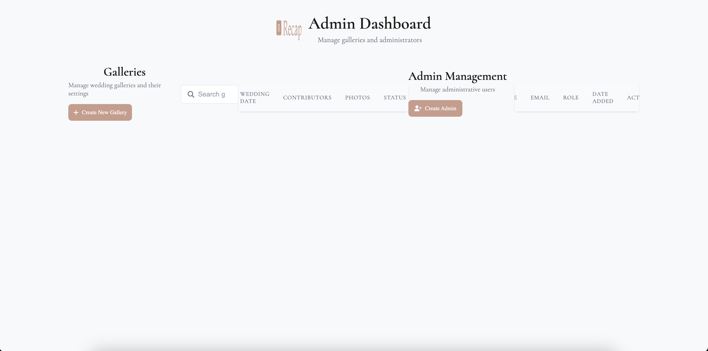
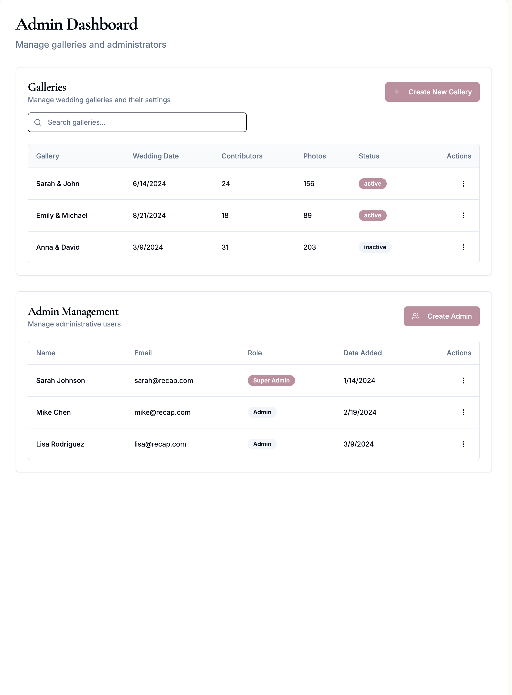

# Admin Page Product Requirements Document (PRD)

## Executive Summary

This document outlines the requirements for enhancing the admin page functionality in the Recap application. The current implementation has basic admin functionality but lacks a dedicated interface for admins to create and manage galleries on behalf of users. This PRD defines a comprehensive admin dashboard that will provide admins with tools to efficiently manage galleries and users.

## Current State Analysis

### Existing Admin Functionality

1. **Admin Flag**: The `person` table has an `isAdmin` boolean field to designate admin users
2. **Admin Detection**: The create gallery page (`/app/create/page.tsx`) detects admin users and bypasses payment/verification
3. **Basic Admin Page**: An admin dashboard exists at `/app/admin/page.tsx` with:
   - Gallery listing with stats (contributors, photos, status)
   - Admin user management section
   - Search functionality for galleries
4. **Admin APIs**: Basic admin APIs exist at `/api/admin/`:
   - `galleries/route.ts` - Lists galleries with stats
   - `admins/route.ts` - Lists admin users and grants admin access
   - `stats/route.ts` - Provides admin statistics
5. **Admin Middleware**: Authentication middleware exists to verify admin access
6. **Action Logging**: Admin actions are logged to the `adminActions` table

### Current Gallery Creation Flow

1. User fills out form with: name, email, gallery name, optional TheKnot/Zola URLs
2. System checks if user exists by email
3. For new users: payment required, then gallery created
4. For existing users: verification email sent, then gallery created
5. Welcome email sent with gallery URL and password
6. Order notification email sent to admin

### Issues with Current Implementation

1. **No Dedicated Admin Creation Flow**: Admins use the same UI as regular users
2. **Limited Gallery Management**: No ability to edit galleries after creation
3. **No Gallery Ownership Visibility**: Admin can't easily see galleries they created for others
4. **Missing Features**: No way to view galleries as admin or manage gallery settings

## Proposed Solution

### Admin Dashboard Enhancements

#### 1. Gallery Management Table

The main admin page should display a comprehensive table of galleries with:

**Table Columns:**
- Gallery Name
- Owner Name & Email
- Wedding Date
- Created Date
- Created By (admin who created it)
- Contributors Count
- Photos Count
- Status (active/inactive based on 30-day activity)
- Actions (View, Edit, Copy Link)

**Features:**
- Search/filter by gallery name, owner name, or email
- Sort by any column
- Pagination (20 items per page)
- Quick access to gallery with auto-login (bypass password)

#### 2. Create Gallery for User

**Dedicated Admin Create Gallery Page** (`/admin/create-gallery`):

**Form Fields:**
- Owner Name (required)
- Owner Email (required)
- Gallery Name (required)
- Wedding Date (optional)
- TheKnot URL (optional)
- Zola URL (optional)

**Flow:**
1. Admin fills out form
2. System creates/finds user by email
3. Gallery created immediately (no payment required)
4. Welcome email sent to gallery owner with:
   - Gallery URL
   - Password
   - Instructions to access their gallery
5. Admin action logged
6. Admin redirected to success page with:
   - Gallery details
   - Quick access link
   - Option to create another gallery

#### 3. Edit Gallery

**Edit Gallery Page** (`/admin/galleries/[galleryId]/edit`):

**Editable Fields:**
- Gallery Name
- Wedding Date
- TheKnot URL
- Zola URL
- Password (with regenerate option)

**Non-editable Fields (displayed for reference):**
- Owner Name & Email
- Gallery Path/URL
- Created Date
- Statistics

**Features:**
- Save changes with confirmation
- View change history (from admin actions log)
- Option to send updated credentials to owner

#### 4. View Gallery as Admin

**Admin Gallery Access:**
- Special admin URL parameter or cookie to bypass password
- Banner showing "Viewing as Admin" when in admin mode
- Ability to switch between admin view and regular view
- Access to all gallery features without restrictions

### API Enhancements

#### 1. Create Gallery API (`POST /api/admin/galleries`)

**Request Body:**
```json
{
  "ownerName": "string",
  "ownerEmail": "string",
  "galleryName": "string",
  "weddingDate": "string (optional)",
  "theKnot": "string (optional)",
  "zola": "string (optional)"
}
```

**Response:**
```json
{
  "gallery": {
    "id": "string",
    "name": "string",
    "path": "string",
    "password": "string",
    "created": "date",
    "ownerId": "string",
    "ownerName": "string",
    "ownerEmail": "string"
  },
  "emailSent": true
}
```

#### 2. Update Gallery API (`PUT /api/admin/galleries/[galleryId]`)

**Request Body:**
```json
{
  "name": "string (optional)",
  "date": "string (optional)",
  "theKnot": "string (optional)",
  "zola": "string (optional)",
  "regeneratePassword": "boolean (optional)"
}
```

#### 3. Get Admin Galleries API Enhancement

Modify existing `/api/admin/galleries` to include:
- Creator admin ID and name
- Owner details (name, email)
- Filter by creator admin ID

### Database Schema Updates

#### 1. Gallery Table Enhancement

Add field:
- `createdByAdminId`: UUID reference to admin who created the gallery

#### 2. Admin Actions Enhancement

Ensure all admin actions include:
- Gallery creation with owner details
- Gallery updates with change details
- Gallery access logs

### Security Considerations

1. **Admin Authentication**: All admin endpoints must verify admin status
2. **Action Logging**: All admin actions must be logged with details
3. **Email Notifications**: Consider notifying gallery owners of admin actions
4. **Access Control**: Admins can only edit/view galleries, not delete them
5. **Password Security**: Gallery passwords should remain secure, only visible during creation

### UI/UX Improvements

1. **Navigation**: Clear admin navigation with sections for Galleries, Users, and Settings
2. **Branding**: Maintain Recap branding with admin-specific styling
3. **Responsive Design**: Ensure all admin pages work on mobile devices
4. **Loading States**: Show loading indicators for all async operations
5. **Error Handling**: Clear error messages with suggested actions
6. **Success Feedback**: Toast notifications or success pages for completed actions

### Visual Design References

#### Current Admin Page Design


The current admin page shows:
- Basic layout with Recap branding
- Two sections: Galleries and Admin Management
- Tables are present but empty
- "Create New Gallery" button redirects to the standard create flow
- Limited functionality and no gallery data displayed

#### Future Admin Page Design


The future admin page design includes:
- **Enhanced Gallery Table**:
  - Gallery names displayed prominently
  - Wedding dates shown
  - Contributors and photos counts
  - Active/inactive status badges
  - Action buttons for each gallery
- **Populated Admin Management Section**:
  - Admin users listed with emails
  - Role badges (Super Admin vs Admin)
  - Date added information
  - Action buttons for user management
- **Improved Visual Hierarchy**:
  - Better spacing and typography
  - Clear section separation
  - Consistent button styling
  - Professional table design with proper headers

**Important Note**: The colors shown in the future design mockup should be adjusted to match the existing Recap application color scheme. The pink/rose color (#c084a9) used throughout the application for buttons and accents should be maintained, along with the consistent gray tones and typography styles currently in use.

### Implementation Plan

#### Phase 1: Core Admin Gallery Creation
1. Create admin gallery creation form and page
2. Implement create gallery API endpoint
3. Add email sending for new galleries
4. Log admin actions

#### Phase 2: Gallery Management
1. Enhance gallery listing with owner details
2. Implement gallery edit functionality
3. Add admin gallery access feature
4. Create gallery detail view for admins

#### Phase 3: Enhanced Features
1. Add bulk actions (future)
2. Implement advanced search/filters
3. Add export functionality for reports
4. Create admin dashboard with statistics

### Success Metrics

1. **Efficiency**: Time to create gallery reduced from 5+ minutes to <2 minutes
2. **Visibility**: Admins can see all galleries they've created
3. **Management**: Ability to edit gallery details post-creation
4. **User Satisfaction**: Gallery owners receive clear welcome emails
5. **Audit Trail**: Complete log of all admin actions

### Future Considerations

1. **Bulk Operations**: Create multiple galleries at once
2. **Templates**: Save gallery settings as templates
3. **Notifications**: Email admins about gallery activity
4. **Reports**: Generate usage reports for galleries
5. **API Access**: Provide API keys for programmatic gallery creation

## Conclusion

This enhanced admin page will significantly improve the admin experience for managing galleries in Recap. By providing dedicated tools for gallery creation and management, admins can efficiently support users while maintaining proper security and audit trails. The implementation should prioritize the core features in Phase 1, with additional enhancements added based on admin feedback and usage patterns.